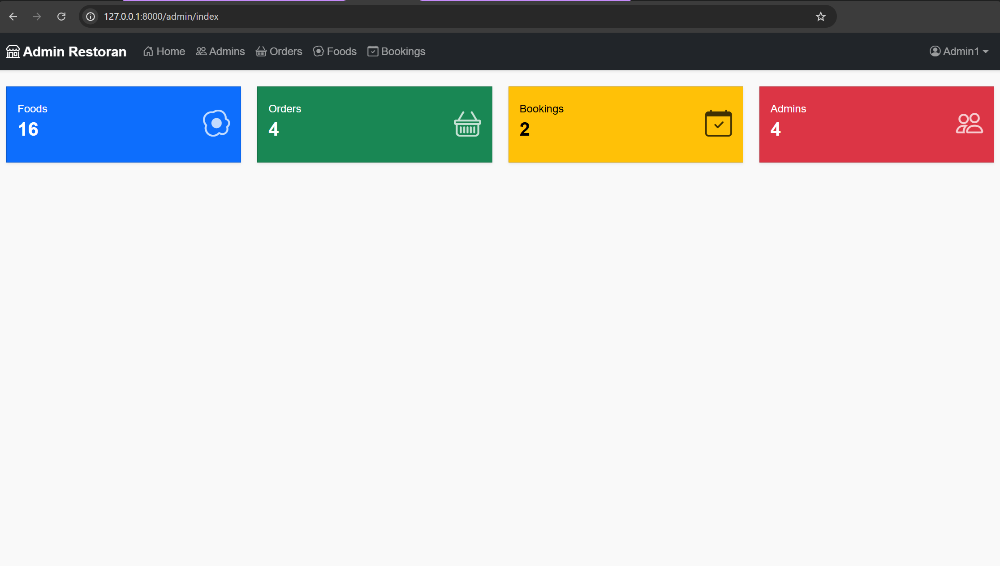

# 🍽️ Restoran

[](https://laravel.com/) 
[](https://www.php.net/) 
[](https://tailwindcss.com/)
[](LICENSE)

A **web-based restaurant management system** built with **Laravel** and **Tailwind CSS**, designed to manage menus, orders, and transactions efficiently.

---

## 📋 Table of Contents

- [Description](#description)  
- [Features](#features)  
- [Technologies](#technologies)  
- [Installation](#installation)  
- [Testing](#testing)  
- [Screenshots](#screenshots-optional)  
- [Contributing](#contributing)  
- [License](#license)

---

## 📝 Description

Restoran is a simple yet powerful restaurant management system with a **responsive UI** and **user-friendly interface**, perfect for small to medium restaurants. It allows restaurant owners and staff to manage their daily operations effectively.

---

## ⚡ Features

- **Menu Management**: Add, edit, and delete food items.  
- **Order Management**: Track and update order statuses.  
- **Transactions & Reports**: Monitor transactions and generate reports.  
- **Responsive Design**: Works on desktop, tablet, and mobile.  
- **User Authentication**: Secure login for admin and staff.

---

## 🛠️ Technologies

- **Backend**: Laravel 9.x  
- **Frontend**: Tailwind CSS, Vite  
- **Database**: MySQL  
- **Authentication**: Laravel Breeze  
- **Testing**: PHPUnit

---

## 🚀 Installation

1. **Clone the repository**:

   ```bash
   git clone https://github.com/HilmiSalsabilla/restoran.git
   cd restoran
   ````

2. **Install PHP dependencies**:

   ```bash
   composer install
   ```

3. **Setup environment**:

   ```bash
   cp .env.example .env
   php artisan key:generate
   ```

4. **Configure database** in `.env`:

   ```ini
   DB_CONNECTION=mysql
   DB_HOST=127.0.0.1
   DB_PORT=3306
   DB_DATABASE=your_database_name
   DB_USERNAME=your_username
   DB_PASSWORD=your_password
   ```

5. **Run migrations**:

   ```bash
   php artisan migrate
   ```

6. **Install frontend dependencies**:

   ```bash
   npm install
   ```

7. **Start the development server**:

   ```bash
   npm run dev
   php artisan serve
   ```

Access the app at [http://localhost:8000](http://localhost:8000).

---

## 🧪 Testing

Run automated tests:

   ```bash
   php artisan test
   ```

---

## 📸 Screenshots (Optional)

Showcase your app with screenshots:




---

## 🤝 Contributing

Contributions are welcome!

1. Fork the repository
2. Create your branch: `git checkout -b feature-name`
3. Commit your changes: `git commit -m "Add some feature"`
4. Push to the branch: `git push origin feature-name`
5. Open a Pull Request

---

## 📄 License

This project is licensed under the **MIT License**. See [LICENSE](LICENSE) for details.

```
Made with ❤️ by [Hilmi Salsabilla](https://github.com/HilmiSalsabilla)
